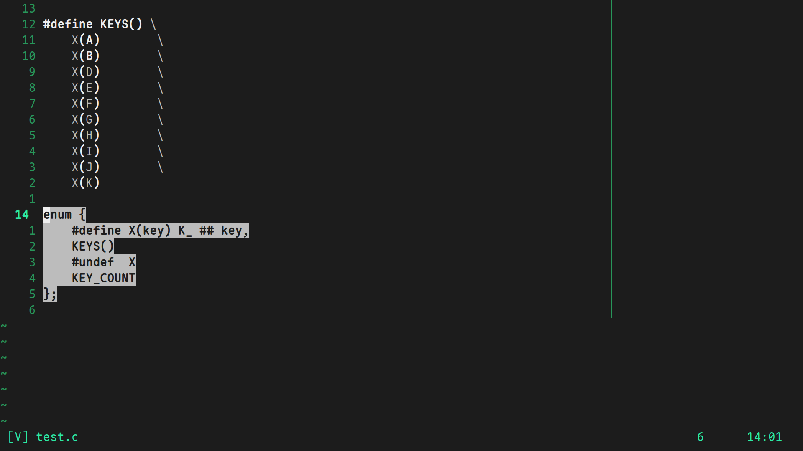

# magic\_macro

preview c macros.

## Required dependencies

c formater for `vim.lsp.buf.format()`

## Installation

`lazy.nvim`
```lua
{
    "numen-0/magic_macro",
    config = function()
        vim.api.nvim_set_keymap("v", "<leader>mm", require("magic_macro").do_the_magic, {})
    end,
}

```

## Usage

1. select (in visual mode) the macro you want to preview



2. execute `do_the_magic()`


Font: [maple](https://github.com/subframe7536/Maple-font)

Full-setup: [.dotfiles/nvim](https://github.com/numen-0/.dotfiles/tree/main/nvim)

