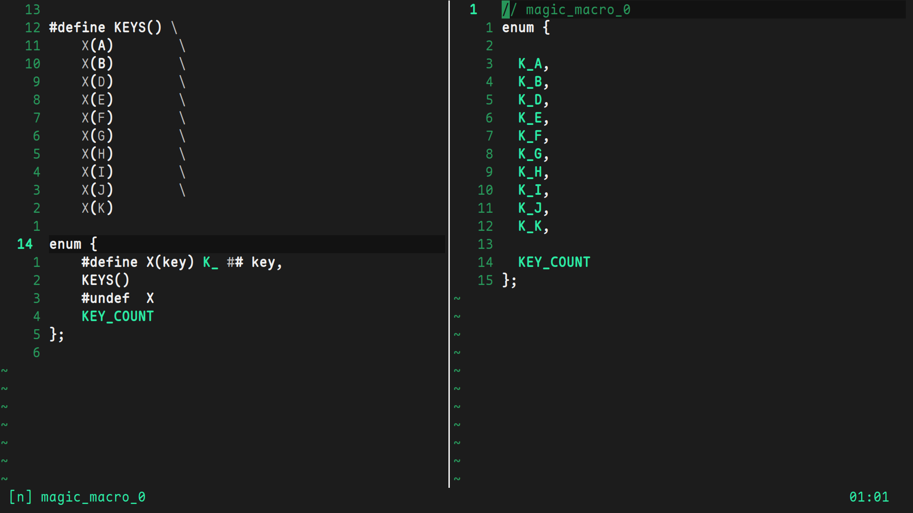

# magic_macro
preview c macros

### install
add the file to your `~/.config/nvim/lua` directory and add the following lines to your `init.lua` (you can change the keymap):
```
require("magic_macro")
vim.api.nvim_set_keymap("v", "<leader>M", ":lua Magic.do_the_magic()<CR>", {})
```

### use
select the macro you want to view


do the thing

